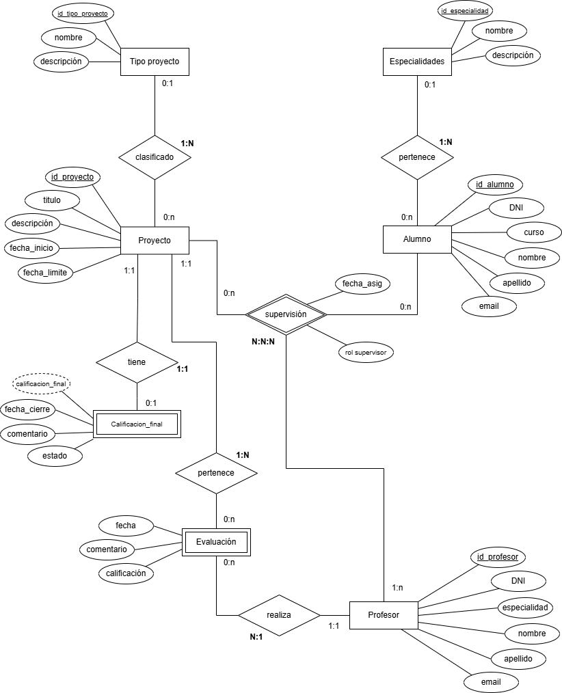

# Practica-UD3

## Descripción proyecto
Aplicación backend desarrollada en Laravel con base de datos MariaDB, es un sistema de gestion de proyectos académicos. Está dockerizado para facilitar su configuración y ejecución en un entorno aislado y consistente, no cuenta con una interfaz web, ya que se basa únicamente en la comunicación mediante peticiones API.

## Descripción del problema
Una escuela de formación profesional, requiere de un sistema para la gestión y seguimiento de los diferentes proyectos académicos finales de los alumnos. Este sistema debe organizar y administrar la información relacionada con los proyectos , los alumnos que lo realizan, el profesor o profesores que supervisan el proyecto y las miembros evaluadores que lo califican. El sistema permitira llevar un control detallado de los trabajos que realice un determinado alumno durante sus estudios, además de facilitar la consulta y generación de reportes. El sistema debe cumplir las siguentes funcionalidades:

- Gestión de proyectos: cada proyecto cuenta con un título, una descripción, una fecha de inicio y una de límite de entrega. En un mismo proyecto pueden participar uno o más alumnos, quienes estarán asociados al proyecto como sus autores. También la comisión evaluadora puede ser de uno o más profesores.
- Gestión de alumnos: los alumnos estan registrados por su nombre, apellido, email, curso, especialidad y el DNI. Un Alumno puede participar en multiples proyectos, como ser supervisado por uno o más profesores.
- Gestión de profesores:los profesores estan registrados por su nombre, apellido, email, año de incorporación y su titulo profesional (especialidad). Un profesor puede supervisar multiples proyecto como Tutor principal o Co-tutor.
- Supervision: el sistema de gestión permitirá llevar seguimiento de los proyectos, enlazando que profesor o profesores supervisan un proyecto que pertenece a uno o más alumnos. Tambien es importante registrar la fecha de asignación y el rol del profesor supervisor.
- Evaluación: Cada proyecto es evaluado por uno o más profesores que no necesariamente seran los tutores. Donde se registra la calificación numérica del 0 al 10, fecha de evaluación y comentarios si fuese necesarios.
- Calificacion final: Una calificacion final pertence a un proyecto y un proyecto puede tener maximo una calificacion final, la calificación final es el promedio calculado en base a las notas asignadas por los profesores evaluadores.
- Tipo de proyecto: los proyectos estarán categorizados en tipos predefinidos como tesis, informes técnicos, proyectos finales de curso (PFC), seminarios, entre otros. Todo proyecto se categoriza en un tipo de proyecto, pero un proyecto puede no estar asignado a un tipo de proyecto.
- Especialidades: cada alumno debe pertenecer a una especialidad, sera posible consultar que o cuantos proyectos hay por especialidad, o cuantos alumnos pertenecen a una especialidad en especifico. Se almacena su nombre y descripcion.

## Diagrama ER



## Way of Working (WoW)

A continuación encontraras información relevante para poder trabajar desde tu ordenador.

### Requisitos tecnologicos

Los requisitos necesarios son:

- **Docker**: Es necesario tener instalado Docker para levantar el contenedor que ejecuta la aplicación junto a la base de datos.
  - Instalación Docker: puedes instalarlo desde el enlace [https://docs.docker.com/get-docker/](https://docs.docker.com/get-docker/).
- **Docker Compose**: Permite la ejecución de múltiples contenedores, como la aplicación Laravel y la BBDD MariaDB.
  - Instalación de Docker Compose: En este enlace [https://docs.docker.com/compose/install/](https://docs.docker.com/compose/install/) encontraras la guía oficial para instalarlo.
- **PHP 8.0 o superior**: Este requerido para la ejecución del framework Laravel, asegurate de tener una versión compatible con Laravel.
  - Intalación PHP: Si prefieres trabajar fuera de Docker, desde este enlace puedes instarlo [https://www.php.net/manual/en/install.php](https://www.php.net/manual/en/install.php)
- **Composer**: Es necesario para gestionar las dependencias de PHP.
  - Instalación de Composer: Desde este enlace [https://getcomposer.org/download/](https://getcomposer.org/download/) puedes instalarlo.
- **Base de Datos MariaDB**: La base de datos que utiliza el proyecto.
  - Instalación de MariaDB: Si estas fuera de Docker, la puedes instalar desde [https://mariadb.org/download/](https://mariadb.org/download/) .  

### Estructura del proyecto
- `practica-UD3/`: Raíz del proyecto
  - `/db_config/`: Contiene Dockerfile con la configuración del contendor para MariaDB.  
  - `/EduPro/`: Contiene el código y configuración del proyecto, para Laravel y MariaDB
  - `docker-compose.yml`: Contiene configuración para levantar los contenedores de ambos servicios, junto con ejecutar las migraciones y seeders de la base de datos.
  - `Dockerfile`: Contiene configuración del contenedor de la aplicación Laravel

### Configuración y ejecución 

**1. Clonar repositorio**: clona el repositorio desde GitHub con git clone. 
```bash
git clone https://github.com/Mila2594/practica-UD3.git
cd practica-UD3
```

**2. Copia y configura archivo .env**: antes de levantar los contenedores es importante que el archivo .env exista dentro del proyecto y con la configuración requerida. 

copiar archivo .env en el directorio del proyecto Laravel: 
```bash
cd EduPro
cp .env.example .env #en Windows usar copy
```

Configuración archivo .env:
```bash
DB_CONNECTION=mariadb
DB_HOST=db
DB_PORT=3306
DB_DATABASE=gestion_proyectos_academicos
DB_USERNAME=root
DB_PASSWORD=m1_s3cr3t
```
Guarda la configuración, ya es hora de ejecutar Docker. 

**3. Iniciar aplicación y servicios**: Para iniciar la aplicación junto al a base de datos, utiliza Docker Compose. Es importante que el servicio de Docker ya este en ejecución. 

Desde el directorio raiz, ejecuta: 
```bash
docker-compose up --build
```
Esto construye la imagen y comunicación de servicios entre Laravel y MariaDB, la aplicación estará lista para trabajar.

**4. Ingresar a MariaDB**: Puedes trabajar directamente con la base de datos desde dentro de su contenedor, es posible hacer consultas, nuevos registros, actualizaciones y más. 

Para ingresar al contenedor y utilizar la base de datos del proyecto: 
```bash
docker exec -it mariadb mariadb -u root -p
USE gestion_proyectos_academicos;
SHOW tables;
```

**5. Probar API con Postman**: Para Comprobar las diferentes solicitudes configuradas en el proyectos puedes importar en fichero `Gestion de Proyectos API.postman_collection.json` desde el directorio raiz del repositorio.

- Para instalar Postman: Sigue las instrucciones del enlace  [https://www.postman.com/downloads/](https://www.postman.com/downloads/).
- Exporta y ejecuta la collection para revisar las respuestas de las solicitudes. 

### Acceso a la Aplicación

La aplicación no fuenta con una interfaz de usuario en el navegador. Para interactuar con la API se recomiendan herramientas de pruebas de API. Las solicitudes a los endpoints de la API se puede realizar a traves de la URL `http://localhost:8000`.

### Comandos útiles
- Detener contenedores sin eliminar los volúmenes:
```bash
docker-compose down
```

- Eliminar contenedores, redes y volúmenes:
````bash
docker-compose down -v
````

- Instalar dependencias de Laravel:
````bash
docker-compose exec app composer install

````

- Ejecutar migraciones:
````bash
php artisan migrate
````

- Ejecutar seeder:
````bash
php artisan seed
````

- Refrescar base de datos:
````bash
php artisan migrate:refresh
````

## Licencia
ste proyecto está licenciado bajo la **MIT License**. Puedes ver más detalles sobre la licencia en el archivo LICENSE dentro del repositorio.
  
